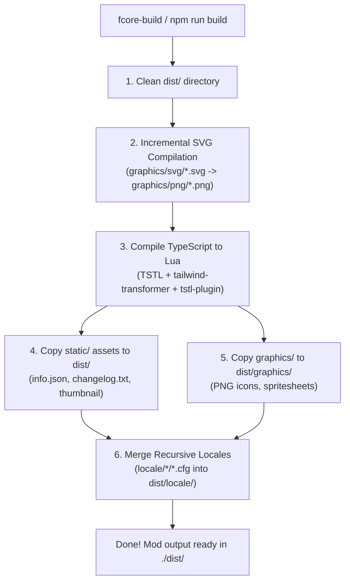
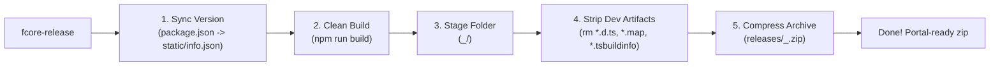

import { Card, CardGrid, Tabs, TabItem } from '@astrojs/starlight/components';

`fcore` provides a zero-config developer infrastructure designed specifically for Factorio 2.0 TypeScript and Lua mod development. Instead of writing custom build scripts, maintaining duplicate release packaging routines, and manually configuring linters across multiple repositories, mods simply inherit the universal `fcore` tooling engine.

---

## 🛠️ Scripts & Tooling Architecture

All development scripts and compiler plugins in `fcore` are located in [`scripts/`](https://github.com/factorio-core/fcore/tree/main/scripts) and exported as first-class modules:

| Script / Tool | CLI Command | Package Export | Description |
| :--- | :--- | :--- | :--- |
| [`build.mjs`](#1-build-pipeline-fcore-build) | `fcore-build` | `fcore/build` | Universal mod builder: cleans `dist/`, runs TSTL, converts SVGs, bundles locales & assets. |
| [`release.mjs`](#2-release-packaging-pipeline-fcore-release) | `fcore-release` | `fcore/release` | Release packager: syncs version to `info.json`, strips dev files, and creates portal-ready zip archives. |
| [`tailwind-transformer.cjs`](#ast-style-transformer) | — | `fcore/tailwind-transformer` | TypeScript AST transformer compiling JSX `className="..."` directly into static Factorio `LuaStyle` properties at build-time. |
| [`tstl-plugin.cjs`](#tstl-import-plugin) | — | `fcore/tstl-plugin` | TypeScript-To-Lua compiler plugin rewriting consumer `fcore/*` imports to native Factorio `require("__fcore__.*")`. |
| [`eslint-preset.mjs`](#3-eslint--lua-52-vm-guardrails-fcoreeslint) | `eslint` | `fcore/eslint` | Pre-packaged ESLint 9 Flat Config enforcing strict Factorio Lua 5.2 VM compatibility and anti-pattern prevention. |
| `eslint.config.mjs` | — | — | Internal ESLint configuration file for linting `fcore`'s own source code. |
| [`prettier.json`](#4-shared-code-formatting-fcoreprettier) | `prettier` | `fcore/prettier` | Unified Prettier configuration (120 print width, single quotes, trailing commas). |
| [`convert-svg.mjs`](#5-asset--codegen-pipelines) | `npm run convert:svg` | — | High-speed incremental SVG-to-PNG icon converter with timestamp-based caching. |
| [`generate-props.ts`](#5-asset--codegen-pipelines) | `npm run generate` | — | Code generator synthesizing JSX prop types for all Factorio elements directly from `typed-factorio`. |

---

## 1. Build Pipeline (`fcore-build`)

Consumer mods (such as `qol` or `cybersyn2-combinator`) require **zero build scripts** in their project root. The build runner is invoked via the `fcore-build` CLI:

```json
{
  "scripts": {
    "build": "npm run format && npm run lint && fcore-build",
    "watch": "fcore-build --watch"
  }
}
```

```bash
# Production build into ./dist:
npx fcore-build

# Continuous incremental watch mode:
npx fcore-build --watch
```

### Build Pipeline Flow



### Detailed Build Steps

1. **Clean `dist/` Directory:** Empties the target distribution directory to prevent stale artifacts from remaining in the build.
2. **Incremental SVG Compilation:** Scans `graphics/svg/` and converts modified vector artwork into crisp PNG icons in `graphics/png/` with smart timestamp caching (`svg.mtimeMs > png.mtimeMs`). If no files changed, step completes in **< 5ms**.
3. **TypeScript-To-Lua (TSTL) Transpilation:**
   - Runs `npx tstl` against the mod's `tsconfig.json`.
   - **AST Style Transformer (`tailwind-transformer.cjs`):** Intercepts JSX elements with `className="..."` and transpiles Tailwind-like utility classes into static Factorio `styles={{ ... }}` objects with zero runtime Lua overhead.
   - **TSTL Path Plugin (`tstl-plugin.cjs`):** Rewrites `fcore` library imports into native Factorio mod require paths (`require("__fcore__.react.index")`).
4. **Static Asset Copying:** Copies files from `./static/` (`info.json`, `thumbnail.png`, `changelog.txt`, `LICENSE`) directly into `./dist/`.
5. **Graphics Asset Copying:** Recursively copies all PNG sprites and spritesheets from `./graphics/` into `./dist/graphics/`.
6. **Recursive Locale Merging:** Traverses modular subfolders in `locale/` (e.g. `locale/en/`, `locale/ru/`) and concatenates `.cfg` sections into unified files in `dist/locale/<lang>/<lang>.cfg`.
7. **Module Asset Discovery:** Recursively detects nested module assets in multi-module mods and bundles them into `dist/`.

---

## 2. Release Packaging Pipeline (`fcore-release`)

Packaging a Factorio mod for the official Mod Portal requires specific folder hierarchies, version synchronization, and exclusion of development files. `fcore-release` automates this entire process with a single command:

```json
{
  "scripts": {
    "release": "fcore-release"
  }
}
```

```bash
npx fcore-release
```

### Release Pipeline Flow



### Release Pipeline Steps

1. **Version Synchronization:** Reads `version` from `package.json` and synchronizes it into `static/info.json`.
2. **Canonical Mod Name Resolution:** Determines the Factorio mod identifier from `static/info.json` (or strips npm `@scope/` organization prefixes).
3. **Clean Production Build:** Runs `npm run build` in the mod root (triggering linting, formatting, SVG conversion, and TSTL compilation).
4. **Folder Staging & Dev File Stripping:** Copies `dist/` into a temporary staging folder `<mod_name>_<version>` and recursively deletes all development artifacts (`.d.ts`, `.tsbuildinfo`, `.js.map`).
5. **Mod Portal-Compliant Zip:** Compresses the staging directory into `releases/<mod_name>_<version>.zip` matching Factorio mod portal specifications (the archive contains a single root folder named `<mod_name>_<version>/`).
6. **Automatic Cleanup:** Removes temporary staging directories.

---

## 3. ESLint & Lua 5.2 VM Guardrails (`fcore/eslint`)

The Factorio Lua 5.2 VM differs significantly from modern JavaScript, Node.js, and browser environments. Using certain JavaScript patterns causes immediate game crashes or memory bloat.

`fcore` provides a pre-packaged, zero-config **ESLint 9 Flat Config** preset that enforces strict Lua 5.2 VM safety directly in your editor.

### One-Line Setup (`eslint.config.mjs`)

In consumer mods, create `eslint.config.mjs` in the project root:

```javascript
export { default } from 'fcore/eslint';
```

All parsers and plugins (`@typescript-eslint/parser`, `@typescript-eslint/eslint-plugin`, `eslint-config-prettier`, `eslint-plugin-react`) are bundled inside `fcore` and initialized automatically.

### Custom Overrides (Optional)

If your mod requires custom rules or file exceptions, use the `createEslintConfig` factory:

```javascript
import { createEslintConfig } from 'fcore/eslint';

export default createEslintConfig({
  overrides: [
    {
      files: ['src/low-level-bridge.ts'],
      rules: {
        'no-restricted-syntax': 'off',
      },
    },
  ],
});
```

---

### Detailed ESLint Guardrail Rules

The linter strictly enforces the following Factorio Lua rules at compile time:

#### 1. Prohibited Global Constructors (`no-restricted-globals`)
In Lua 5.2 VM, `Boolean`, `Number`, and `String` globals are `nil`. Calling them crashes the game immediately (`attempt to call global 'Boolean' (a nil value)`):

```ts
// ❌ Anti-pattern: Crashes immediately in Lua VM
const key = String(item.key);
const count = Number(textValue);
const isValid = Boolean(value);

// ✅ Correct Pattern: Use native Lua functions & boolean expressions
const key = tostring(item.key);
const count = tonumber(textValue);
const isValid = value !== undefined && value !== false;
```

#### 2. Table Key Deletion (`no-restricted-syntax`)
In TSTL, `delete obj[key]` generates the `__TS__Delete` runtime polyfill. Assigning `undefined` compiles to a single native Lua opcode instruction (`obj[key] = nil`):

```ts
// ❌ Anti-pattern: Emits heavy __TS__Delete helper
delete storage.windows[playerIndex];

// ✅ Correct Pattern: Compiles to single opcode storage.windows[playerIndex] = nil
storage.windows[playerIndex] = undefined;
```

#### 3. Clearing Arrays (`no-restricted-syntax`)
Setting `.length = 0` generates `__TS__ArraySetLength`. Assigning `[]` compiles directly to an empty Lua table `{}`:

```ts
// ❌ Anti-pattern: Emits __TS__ArraySetLength helper
items.length = 0;

// ✅ Correct Pattern: Compiles to items = {}
items = [];
```

#### 4. Heavy Collections (`no-restricted-syntax`)
`new Map()` and `new Set()` emit heavy class instances via `__TS__New`. Native Lua hash tables are already $O(1)$:

```ts
// ❌ Anti-pattern: Heavy class instantiations
const cache = new Map<string, Item>();
const seen = new Set<string>();

// ✅ Correct Pattern: Zero-overhead native Lua tables
const cache: Record<string, Item> = {};
const seen: Record<string, boolean> = {};
```

#### 5. Object Property Enumeration (`no-restricted-properties`)
Methods like `Object.keys()`, `Object.values()`, and `Object.entries()` allocate intermediate JavaScript array polyfills on the Lua heap. In Factorio Lua, use native `pairs()`:

```ts
// ❌ Anti-pattern: Allocates intermediate key arrays
for (const key of Object.keys(data)) { ... }

// ✅ Correct Pattern: Direct Lua pairs() with 0 heap allocations
for (const [key, value] of pairs(data)) { ... }
```

#### 6. Direct Event Registration (`no-restricted-syntax`)
Calling `script.on_init()`, `script.on_load()`, `script.on_event()`, or `script.on_nth_tick()` directly in mod files overwrites previous handlers and breaks React hydration and scheduler systems:

```ts
// ❌ Anti-pattern: Overwrites handler and breaks multi-module bus
script.on_event(defines.events.on_gui_click, handler);

// ✅ Correct Pattern: Centralized event bus from fcore
import * as event from 'fcore/utils/event';
event.on(defines.events.on_gui_click, handler);
```

#### 7. Inline Type Imports (`no-restricted-syntax`)
Inline type imports (`import('...').Type`) are prohibited by project conventions to maintain clean dependency trees:

```ts
// ❌ Anti-pattern: Inline import
function onClick(e: import('factorio:runtime').OnGuiClickEvent) { ... }

// ✅ Correct Pattern: Explicit top-level type import
import type { OnGuiClickEvent } from 'factorio:runtime';
function onClick(e: OnGuiClickEvent) { ... }
```

#### 8. Callback Context Signature (`(this: void)`)
In TypeScript, callbacks without explicit `this: void` context annotations generate an implicit `self` parameter in Lua (`function(____, e)`). When invoked by the Factorio C++ engine, arguments shift by 1 position:

```ts
// ❌ Anti-pattern: Implicit self shifts arguments in Lua
type ClickHandler = (e: OnGuiClickEvent) => void;

// ✅ Correct Pattern: Guarantees exact 1:1 parameter passing in Lua
type ClickHandler = (this: void, e: OnGuiClickEvent) => void;
```

---

## 4. Shared Code Formatting (`fcore/prettier`)

`fcore` exports a standardized Prettier configuration. Instead of maintaining `.prettierrc` or `.prettierrc.json` files across mod repositories, declare Prettier directly in `package.json`:

```json
{
  "prettier": "fcore/prettier"
}
```

### Prettier Rules Enforced:
* `printWidth: 200`
* `singleQuote: true` (standard modern TypeScript convention)
* `trailingComma: "all"` (clean, readable git diffs)
* `tabWidth: 2` (standard 2-space indentation)
* `semi: true` (explicit semicolons)
* `arrowParens: "always"` (clean parameter typing in arrow callbacks)
* `endOfLine: "lf"` (Unix line endings for cross-platform compatibility)

Both IDEs (VS Code, Cursor, WebStorm) and the `npm run format` CLI (`prettier --write ...`) resolve `fcore/prettier` natively without requiring any local `.prettierrc*` files.

---

## 5. Asset & Codegen Pipelines

### Incremental SVG Compilation (`convert-svg.mjs`)
Factorio requires PNG sprites. Storing raw SVG vectors in `graphics/svg/` ensures high-quality source artwork, while `fcore` handles the conversion to PNG automatically during build.

- **Timestamp Caching:** SVG files are only re-rendered if the target PNG is missing or if `svg.mtimeMs > png.mtimeMs`.
- **Target Resolution:** Standard icons are generated at `64x64` with 2x scale (`scale: 0.5`) for crisp display on high-DPI screens.

To register a compiled icon in Factorio's prototype stage:

```typescript
// data.ts
data.extend([
  {
    type: "sprite",
    name: "my_icon",
    filename: "__my-mod__/graphics/png/my_icon.png",
    size: 64,
    scale: 0.5,
    flags: ["gui-icon"],
  },
]);
```

### JSX Prop Type Generator (`generate-props.ts`)
`fcore` uses ts-morph to analyze the `typed-factorio` prototype definitions and automatically generate type-safe JSX element definitions in `src/react/generated-props.ts`. This ensures that all native Factorio GUI elements (`<button>`, `<textfield>`, `<frame>`, `<table_>`, `<flow>`, `<slider>`) have strict, autocomplete-friendly TypeScript prop types matching Factorio 2.0.

---

## 6. Tailwind AST Transformer & Style Engine (`tailwind-transformer.cjs`)

Factorio's C++ UI engine operates strictly through prototype style objects (`LuaStyle`). Parsing CSS classes or calculating layout styles at runtime in Lua would severely impact tick times and garbage collection.

`fcore` solves this by introducing a **compile-time AST Transformer** (`scripts/tailwind-transformer.cjs`). During the TSTL compilation step, `className="..."` attributes on JSX elements are analyzed, validated, and translated directly into native Factorio `styles={{ ... }}` table literals. In the resulting Lua code, `className` disappears entirely, resulting in **0 ms runtime overhead and zero string allocations**.

### Key Features

1. **Zero-Overhead Compilation:** Utility classes (`font-bold`, `p-4`, `w-145`, `items-center`) are replaced with static Lua table properties at build-time.
2. **`tailwind.config.cjs` Support:** Consumer mods can define custom colors and composite shortcuts in a root configuration file.
3. **Complete Standard Tailwind Color Palette (50–950):** Built-in support for all 22 official Tailwind color families (`slate`, `gray`, `zinc`, `neutral`, `stone`, `red`, `orange`, `amber`, `yellow`, `lime`, `green`, `emerald`, `teal`, `cyan`, `sky`, `blue`, `indigo`, `violet`, `purple`, `fuchsia`, `pink`, `rose`) across all 11 luminance shades (`50`, `100`, `200`, `300`, `400`, `500`, `600`, `700`, `800`, `900`, `950`). Unnumbered names default to standard midtones (`text-red` -> `red-500`, `text-amber` -> `amber-400`).
4. **Factorio Alpha Channel & Opacity Modifiers:** Support for Tailwind's slash opacity syntax (`text-white/70`, `text-amber-400/80`, `/5` through `/95`), which transpiles directly into Factorio `{ r = ..., g = ..., b = ..., a = ... }` RGBA float structures.
5. **Shortcuts (Composite Utilities):** Group repeated utility combinations into semantic keys (e.g. `row-title`, `power-label`, `banner-error`). Shortcuts are expanded recursively at build-time with cycle detection.
6. **Conditional Expressions:** Dynamic ternary expressions like `className={isError ? 'font-bold text-red-500' : 'font-bold text-white'}` compile into pure Lua branching table literals (`if isError then { ... } else { ... } end`).
7. **Strict TypeScript Type Safety:** Every utility token, color shade, and shortcut is validated at compile-time via `ClassNameProp<E>`. Invalid tokens produce precise TypeScript compile errors.

### Configuring `tailwind.config.cjs`

Because all standard Tailwind colors and shades are built into `fcore`, you only need `tailwind.config.cjs` (or `fcore.tailwind.cjs`) to define custom composite shortcuts or project-specific aliases. You can place the config anywhere inside `src/` (e.g., `src/tailwind.config.cjs` or inside a specific module directory):

```javascript
// src/tailwind.config.cjs
module.exports = {
  shortcuts: {
    'heading-1': 'font-heading-1 text-amber-400',
    'power-label': 'font-small-semibold text-center h-15 text-amber-400',
    'banner-error': 'font-bold text-red-500',
    'table-index': 'font-bold text-sky-400 w-24',
    'row-title-neg': 'font-bold w-145 items-center text-amber-400',
    'row-title-pos': 'font-bold w-145 items-center text-emerald-400',
  },
};
```

### Automatic TypeScript Autocomplete (`tailwind.d.ts`)

During every build (`fcore-build`), the style engine automatically searches `src/`, reads your configuration, and generates `tailwind.d.ts` right next to your config file:

```typescript
// src/tailwind.d.ts (Auto-generated by fcore-build - do not edit manually)
import 'fcore/styles/_tailwind';

declare module 'fcore/styles/_tailwind' {
  interface CustomTailwindTheme {
    'heading-1': true;
    'power-label': true;
    'banner-error': true;
    'table-index': true;
    'row-title-neg': true;
    'row-title-pos': true;
  }
}
```

Because `tsconfig.json` includes `"src/**/*"`, your custom shortcuts and colors become immediately available in TypeScript with full type safety and IDE autocomplete—without any manual maintenance.

### Usage Example in JSX

```tsx
// Using standard utilities, opacity modifiers, and shortcuts:
<Frame direction="horizontal" style="bordered_frame" className="stretch items-center">
  {/* Shortcut class */}
  <Label caption="Desired Ingredients" className="row-title-neg" />

  {/* Standard color with opacity modifier: text-white with 70% alpha */}
  <Label caption="Active Status" className="font-small text-white/70" />

  {/* Conditional class compilation */}
  <Label
    caption="Power Consumption"
    className={isOverloaded ? 'power-label text-red-500' : 'power-label'}
  />
</Frame>
```

Compiled Lua output:

```lua
-- Lua output generated by fcore build (zero runtime parsing):
createElement(Label, {
  styles = { font = "default-bold", width = 145, vertical_align = "center", font_color = { r = 0.984, g = 0.749, b = 0.141 } },
  caption = "Desired Ingredients"
})
```

---

## 🎨 Built-In Sprite Library

`fcore` includes a library of standard UI icons pre-registered in Factorio's prototype stage (`data.raw.sprite`). Any mod declaring a dependency on `fcore` can use these sprites immediately in JSX components without bundling image files:

```tsx
<SpriteButton
  sprite="react_questionmark"
  tooltip="Show Documentation"
  onClick={() => openDocs()}
/>
```

### Available Action Icons

| Sprite Name | Preview Description | Common Use Case |
| :--- | :--- | :--- |
| `react_questionmark` | Help / info circular question mark | Help dialogs, tooltips, tutorials |
| `react_filter_all` | Funnel filter with globe indicator | Global / public filter toggle |
| `react_filter_private` | Funnel filter with lock indicator | Private / player filter toggle |
| `react_plus_white` | Crisp white add icon | Add row, create new entry, add tab |
| `react_trash_white` | Crisp white delete icon | Delete row, remove entry, clear |
| `react_check_green` | Green checkmark badge | Status OK, verified, active |
| `react_close_red` | Red cross mark badge | Close button, error, cancel |
| `react_pin_black` / `react_pin_white` | Pin window toggle | Pinning floating GUI windows |
| `react_settings_white` / `react_settings_black` | Settings gear icon | Preferences, configuration modal |

### Status Indicators (`react_indicator_<color>`)

Pre-rendered colored status dot sprites for indicators, server states, and item tiers:
`react_indicator_green`, `react_indicator_red`, `react_indicator_yellow`, `react_indicator_blue`, `react_indicator_orange`, `react_indicator_cyan`, `react_indicator_purple`, `react_indicator_pink`, `react_indicator_white`, `react_indicator_black`.
