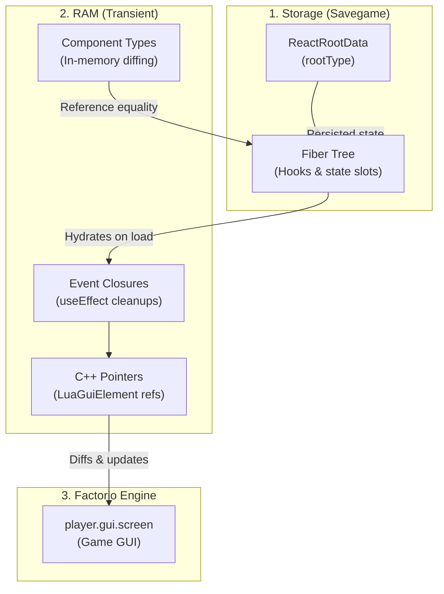

`fcore/react` brings modern declarative React architecture to Factorio 2.0. Write clean JSX components with stateful hooks (`useState`, `useReducer`, `useEffect`, `useMemo`, `useCallback`, `useRef`, `useInterval`, `useWindow`, `useEntityLifecycle`), while the reconciler manages C++ `LuaGuiElement` lifecycles, intelligent sub-tree bailouts, and multiplayer savegame persistence.

---

## 🏛 How It Works: The Dual-Memory Architecture

Factorio requires multiplayer simulation state to be serializable, while native C++ pointers (`LuaGuiElement`) and closures exist only in volatile RAM. `fcore` automatically splits UI state into two synchronized layers:



> **Zero Setup Overhead:** `fcore/react` self-initializes automatically when imported in your mod's `control.ts`. No manual bootstrap or event subscription calls are needed.

---

## 🚪 1. Creating & Mounting Windows

### Root Windows vs. Child Components

* **Root Window Components (Registered):**
  Top-level window components passed to `createRoot` **must be registered** with `registerComponent("WindowName", WindowComponent)`. On game reload (`on_load`), React reads the string `"WindowName"` from `storage.reactRoots` and re-attaches the component function.
* **Child Components (Unregistered):**
  Child JSX components (`<TabbedPane>`, `<Button>`, `<SlotButton>`, custom sub-components) are resolved dynamically in RAM during the parent's render pass. They **do not require registration**.

### Complete Window Example

```tsx
import { createElement, useState, registerComponent, createRoot } from "fcore/react";
import { WindowFrame, Titlebar, VFlow, HFlow, Button, Label } from "fcore/react-components";
import type { PlayerIndex } from "factorio:runtime";

export interface CounterWindowProps {
  playerIndex: PlayerIndex;
  initialCount?: number;
  onClose: (this: void) => void;
}

export function CounterWindow({ playerIndex, initialCount = 0, onClose }: CounterWindowProps) {
  const [count, setCount] = useState(initialCount);

  return (
    <WindowFrame styles={{ width: 320 }}>
      <Titlebar caption="Counter Window" onClose={onClose} />
      <VFlow styles={{ padding: 12, gap: 10 }}>
        <HFlow styles={{ vertical_align: "center", gap: 8 }}>
          <Label caption="Current value:" />
          <Label caption={tostring(count)} styles={{ font: "default-bold" }} />
        </HFlow>

        <HFlow styles={{ gap: 8 }}>
          <Button caption="-1" onClick={() => setCount((prev) => prev - 1)} />
          <Button caption="+1" style="confirm_button" onClick={() => setCount((prev) => prev + 1)} />
          <Button caption="Reset" style="red_button" onClick={() => setCount(0)} />
        </HFlow>
      </VFlow>
    </WindowFrame>
  );
}

// 1. Register ONLY the root window component once
registerComponent("CounterWindow", CounterWindow);

// 2. Open the window for a player
export function openCounterWindow(playerIndex: PlayerIndex) {
  const player = game.get_player(playerIndex);
  if (!player) return;

  const root = createRoot(player.gui.screen, "counter_window");
  root.render(
    <CounterWindow
      playerIndex={playerIndex}
      onClose={() => root.unmount()}
    />
  );
}
```

---

## 🪝 2. React Hooks Reference

`fcore/react` provides standard React hooks as well as specialized Factorio hooks optimized for high-performance modding.

### `useState`
Declares a state variable persisted in `storage.reactRoots` across multiplayer saves and reloads:

```tsx
const [count, setCount] = useState(0);
const [name, setName] = useState(() => calculateInitialName());

// Updater syntax with previous state
setCount((prev) => prev + 1);
```

### `useReducer`
Manages complex state logic with predictable action transitions:

```tsx
interface State {
  count: number;
  step: number;
}

type Action = { type: "increment" } | { type: "set_step"; step: number };

function reducer(state: State, action: Action): State {
  switch (action.type) {
    case "increment":
      return { ...state, count: state.count + state.step };
    case "set_step":
      return { ...state, step: action.step };
  }
}

const [state, dispatch] = useReducer(reducer, { count: 0, step: 1 });

dispatch({ type: "increment" });
dispatch({ type: "set_step", step: 5 });
```

### `useEffect` & `useLayoutEffect`
Runs side effects after the virtual tree and C++ GUI elements are committed. Returns an optional cleanup function that runs on unmount or dependency change:

```tsx
useEffect(() => {
  strace.info("gui", "window_opened", playerIndex);

  return () => {
    strace.info("gui", "window_closed", playerIndex);
  };
}, [playerIndex]);
```

### `useMemo` & `useCallback`
Caches expensive calculations or creates stable callback references in transient RAM:

```tsx
// Recompute model instances or filtered lists only when dependencies change:
const combinator = useMemo(() => {
  return entity.valid ? new Combinator(entity) : undefined;
}, [entity]);

// Stable callback reference preventing child re-renders:
const handleSelectSignal = useCallback((signal: SignalID) => {
  setSelectedSignal(signal);
}, []);

return <CombinatorTab combinator={combinator} onSelect={handleSelectSignal} />;
```

### `useRef`
Creates a mutable `{ current: T }` reference that persists in transient RAM without triggering re-renders:

```tsx
const textInputRef = useRef<LuaGuiElement>();
const renderCountRef = useRef(0);
renderCountRef.current++;

return <Input ref={textInputRef} text="Default" />;
```

### `useInterval`
Schedules a periodic callback via the global discrete bucketed scheduler. Zero `on_tick` CPU overhead when GUI is closed:

```tsx
// Updates every 60 ticks (1 second)
useInterval(() => {
  refreshTelemetry();
}, 60);

// Pass undefined or <= 0 to pause
useInterval(pollNetwork, isPollingActive ? 30 : undefined);
```

### `useDebouncedCallback`
Postpones function execution until `N` game ticks have elapsed since the last invocation:

```tsx
// Debounce search input by 15 ticks (250ms)
const handleSearchChange = useDebouncedCallback((text: string) => {
  setQuery(text);
}, 15);

return <Input onTextChanged={(e) => handleSearchChange(e.element.text)} />;
```

### `useEntityLifecycle`
Tracks game entity mining, destruction, or blueprint revival, keeping the GUI synchronized with the world:

```tsx
useEntityLifecycle(combinatorEntity, {
  onDestroyed: () => {
    onClose(); // Automatically close window if entity is mined or destroyed
  },
  onRevived: (newEntity) => {
    setEntity(newEntity); // Reconnect to newly revived ghost/entity
  },
});
```

### `useWindow`
Full-featured top-level window controller providing auto-centering, drag coordinate persistence across sessions, pinning, and 'E'/Escape closing:

```tsx
import { useWindow } from "fcore/react";

export function CustomWindow({ playerIndex, onClose }: { playerIndex: PlayerIndex; onClose: () => void }) {
  const window = useWindow(playerIndex, {
    autoCenter: false, // Save and restore last dragged position
    pinnable: true,    // Enable pinning to keep window open during gameplay
    closeOnEscape: true,
  });

  return (
    <WindowFrame
      pinned={window.pinned}
      onLocationChanged={window.onLocationChanged}
    >
      <Titlebar
        caption="Pinnable Window"
        pinned={window.pinned}
        onTogglePin={window.togglePin}
        onClose={window.close}
      />
      {/* Window contents */}
    </WindowFrame>
  );
}
```

> **Note:** The built-in `<WindowFrame>` component automatically integrates `useWindow` when passed `playerIndex`, `pinnable`, and `onClose` props.

---

## ⚡ 3. Reconciler Architecture & Performance

The `fcore` virtual DOM reconciler is designed specifically for the performance characteristics of Factorio's Lua 5.2 VM:

1. **In-Memory Component Identity:**
   In Factorio 2.0 Lua VM, `tostring(any_function)` returns `"function"` to prevent multiplayer desyncs. The reconciler tracks live component function references in RAM (`transient.elementType`), ensuring that dynamically swapping components (such as tabs) unmounts the previous branch and mounts the new one cleanly without requiring artificial key boilerplate.
2. **Zero-Cost Sub-Tree Bailouts:**
   When a state update occurs (`setState`), only the dirty branch is scheduled for evaluation. If parent props passed to a child component are shallowly equal (`arePropsEqual`), the reconciler immediately cancels traversal of that subtree at 0 ms CPU cost.
3. **Minimal C++ / Lua Boundary Transitions:**
   Accessing native `LuaGuiElement` properties crosses the C++ bridge. The reconciler diffs every property against previous values and only writes to the Factorio engine when a value has actually changed (`prevVal !== nextVal`).

---

## 💡 Best Practices

1. **Keys in dynamic lists:** Always specify a unique `key` when rendering lists (`items.map(item => <SlotButton key={item.id} />)`) so the reconciler moves elements without recreation.
2. **Register only roots:** Only top-level window components passed to `createRoot` need `registerComponent`. Child components do not require registration.
3. **Bailout optimization:** If `setState` receives the exact same value (`prev === next`), the reconciler immediately cancels rendering at 0 ms cost.
4. **Stable callback references:** Wrap callbacks passed to deeply nested children in `useCallback` to maximize sub-tree bailout efficiency.
5. **General TSTL rules:** For language-level conventions (such as explicit `(this: void)` annotations, boolean checks, and memory management), see the [TSTL Best Practices](/mods_factorio/#-tstl-best-practices-for-factorio-lua) section on the introduction page.
