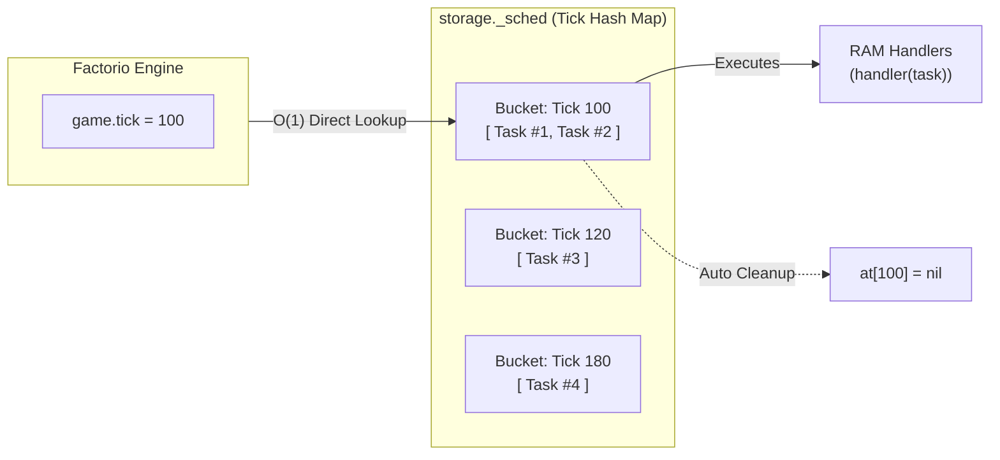

The `fcore/utils/scheduler` module provides a discrete, tick-bucketed scheduling engine for Factorio 2.0. It eliminates CPU frame-time spikes (UPS drops) caused by naive `on_tick` per-frame polling.

---

## 🏛 How It Works: Discrete Tick Bucketing

Instead of iterating through thousands of entities or tables every game frame, the scheduler stores task IDs in discrete tick buckets in `storage._sched.at[tick]`. On each game frame, only the bucket matching `game.tick` is accessed with $O(1)$ lookup:



---

## 🚀 1. Registering Task Handlers

Handlers are registered at the module top level by unique string names. This ensures tasks survive multiplayer save/load cycles without storing closures or functions in `storage`:

```ts
import * as scheduler from "fcore/utils/scheduler";
import type { PlayerIndex } from "factorio:runtime";

export interface ScanTaskData {
  networkId: number;
  playerIndex: PlayerIndex;
}

// Register handler once in control.ts or module scope
scheduler.register_handler<ScanTaskData>("scan_network", (task) => {
  const data = task.data;
  if (!data) return;

  const player = game.get_player(data.playerIndex);
  if (!player || !player.valid) {
    return scheduler.ABORT; // Cancel recurring task if player left
  }

  log(`Scanning network #${data.networkId} for player ${player.name}`);
});
```

---

## ⏱ 2. One-Shot Delayed Tasks (`after` / `at`)

Schedule tasks to execute after a relative delay or at an absolute future game tick:

```ts
import * as scheduler from "fcore/utils/scheduler";

// 1. Run after 120 ticks (2 seconds)
const taskId = scheduler.after<ScanTaskData>(120, "scan_network", {
  networkId: 1,
  playerIndex: player.index,
});

// 2. Run at an exact absolute game tick
scheduler.at<ScanTaskData>(game.tick + 300, "scan_network", {
  networkId: 2,
  playerIndex: player.index,
});
```

---

## 🔄 3. Recurring Interval Tasks (`every` / `first_then_every`)

Schedule periodic background workers and manage their lifecycle:

```ts
import * as scheduler from "fcore/utils/scheduler";

// 1. Run every 60 ticks (1 second) starting from (game.tick + 60)
const recurringId = scheduler.every<ScanTaskData>(60, "scan_network", {
  networkId: 1,
  playerIndex: player.index,
});

// 2. Run on tick 100 first, then repeat every 60 ticks thereafter
const customId = scheduler.first_then_every<ScanTaskData>(
  game.tick + 10,
  60,
  "scan_network",
  { networkId: 2, playerIndex: player.index }
);

// 3. Check if a task is still active
if (scheduler.is_valid(recurringId)) {
  // Cancel task programmatically
  scheduler.stop(recurringId);
}
```

---

## 🛑 4. Self-Cancelling Tasks with `scheduler.ABORT`

A recurring handler can cancel its own future iterations by returning `scheduler.ABORT`. This eliminates the need to track `taskId` externally:

```ts
scheduler.register_handler<{ entityId: UnitNumber }>("check_entity_health", (task) => {
  const entity = findEntity(task.data?.entityId);

  // If entity was mined or destroyed, cancel further checks
  if (!entity || !entity.valid) {
    return scheduler.ABORT;
  }

  // Otherwise continue running on schedule
  updateHealthBar(entity);
});
```

---

## ⚛️ 5. Integration with React Hooks

The `fcore/react` package builds its timing hooks directly on top of the scheduler:

* **`useInterval(callback, ticks)`**: Schedules a recurring timer using discrete tick buckets with automatic cleanup when the component unmounts.
* **`useDebouncedCallback(callback, delayTicks)`**: Postpones execution until `delayTicks` have passed since the last invocation.

---

## 💡 Best Practices

1. **Keep payload serializable:** `task.data` is persisted in `storage._sched`. Store only primitive types, IDs (`UnitNumber`, `PlayerIndex`), or simple tables. Never store `LuaEntity`, `LuaGuiElement`, or closures.
2. **Use `scheduler.ABORT` for cleanup:** When a tracked target is destroyed or invalidated, return `scheduler.ABORT` from inside the handler to prevent orphan tasks in `storage`.
3. **Avoid tick 0 or past ticks:** `scheduler.at()` automatically warns and rejects scheduling tasks at or before `game.tick`.
