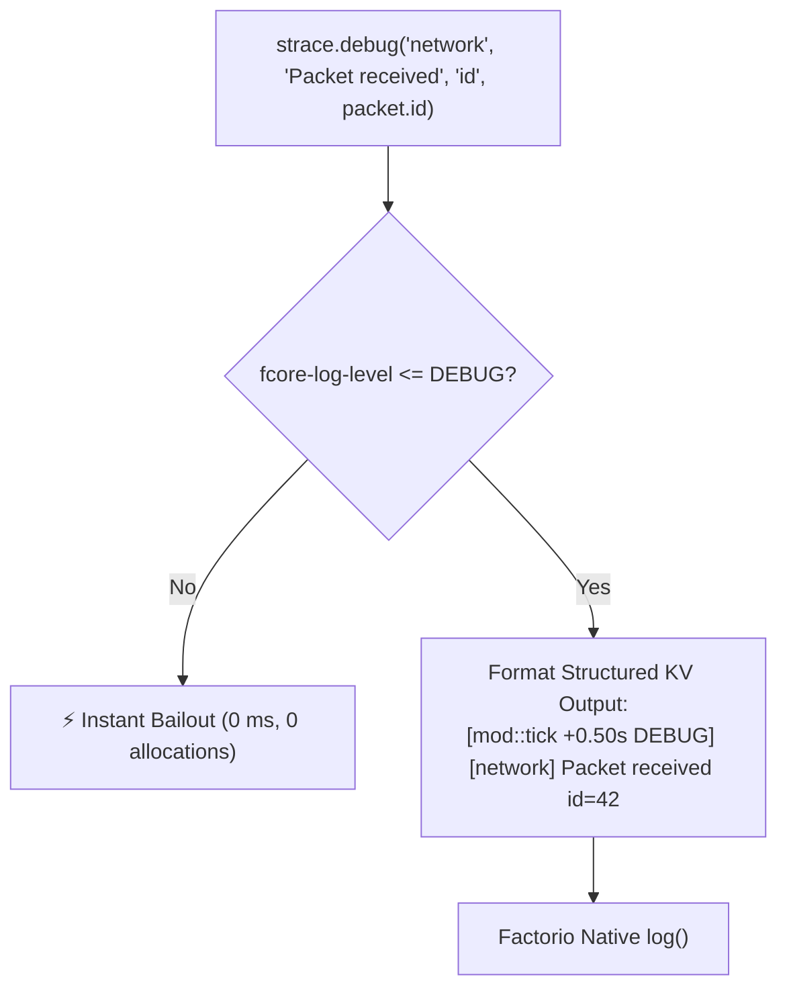
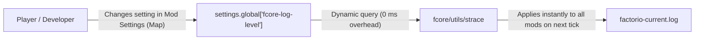

The `fcore/utils/strace` module provides structured, multi-level diagnostic logging with **zero runtime overhead** when logging levels are disabled. It supports structured key-value formatting, deferred (lazy) argument evaluation, and dynamic real-time log level configuration via Factorio in-game mod settings.

---

## 🎯 The Problem with Raw `log()`

Standard `log()` in Factorio Lua has three major drawbacks in mod development:

1. **Unconditional String & Table Allocation:** Constructing strings (`log("Player " .. id .. " clicked " .. name)`) generates Lua garbage on every call even when logs are disabled.
2. **Expensive Parameter Evaluation:** Serializing large tables (`serpent.line(table)`) or calculating metrics executes eagerly before passing arguments into `log()`, burning CPU cycles during gameplay.
3. **No Dynamic Filtering:** Developers cannot toggle verbose diagnostic tracing without commenting out code or rebuilding the mod.

---

## 🏗 `strace` Architecture & Log Levels

`strace` uses a strict numeric priority check. If the current level is below the configured threshold, execution bails out immediately with **0 ms cost and 0 memory allocations**:



### Log Levels Hierarchy

| Level | Priority | Description | Use Case |
| :--- | :---: | :--- | :--- |
| **`TRACE`** | `0` | Ultra high-frequency tracing | Reconciler DOM diffing, scheduler tick dispatch, input events |
| **`DEBUG`** | `1` | Detailed diagnostic state | Coordinates, serialization dumps, network packet payloads |
| **`INFO`** | `2` | Key lifecycle milestones | Window mounted, entity built, settings synced |
| **`STATS`** | `3` | Performance & profiling stats | Benchmarks, cache hit rates, queue latency |
| **`WARN`** | `4` | Recoverable warnings | Missing optional entity prototypes, fallback triggered |
| **`ERROR`** | `5` | Exceptions & fatal errors | Invariant violations, unhandled event exceptions |
| **`NONE`** | `6` | Completely silent | Disables all logging output entirely |

---

## 📖 API & Patterns

### 1. Structured Key-Value Logging

Instead of manual string concatenation, pass the module/subsystem tag, the action description, and alternating key-value pairs:

```ts
import { strace } from "fcore/utils/strace";

// Output: [my-mod::120 +2.00s INFO] [gui] Window opened playerIndex=1 windowKey="main_panel"
strace.info("gui", "Window opened", "playerIndex", player.index, "windowKey", "main_panel");

// Output: [my-mod::120 +2.00s DEBUG] [sched] Tick processed tick=1042 taskCount=3
strace.debug("sched", "Tick processed", "tick", game.tick, "taskCount", tasks.length);

// Output: [my-mod::120 +2.00s WARN] [combinator] Network not found networkId=99
strace.warn("combinator", "Network not found", "networkId", targetId);
```

#### Output Log Format

Each message written to `factorio-current.log` is formatted predictably:
```text
[<mod_name>::<ticks_played> <+relative_time> <LEVEL>] [<tag>] <action> <key1>=<val1> <key2>=<val2>
```

---

### 2. Lazy Evaluation (`*Lazy`) for Zero Overhead

When logging large data structures or computing expensive diagnostics, passing expressions directly into `strace.debug()` still evaluates them eagerly before calling the function:

```ts
// ❌ BAD: serpent.block and deepScan are executed on EVERY call even if DEBUG is disabled!
strace.debug("network", "State dump", "state", serpent.block(deepScan(networkState)));
```

To eliminate all performance impact, use **lazy logging methods** (`traceLazy`, `debugLazy`, `infoLazy`, `warnLazy`, `errorLazy`). Pass a closure returning the arguments array:

```ts
// ✅ EXCELLENT: The closure is ONLY executed if DEBUG log level is active!
strace.debugLazy("network", "State dump", () => [
  "nodeCount", countNodes(networkState),
  "state", serpent.block(deepScan(networkState)),
]);

// Single callback overload:
strace.traceLazy(() => [
  "vdom",
  "Diff calculation complete",
  "diffTree", deepDiff(prevFiber, nextFiber),
]);
```

> [!TIP]
> If `DEBUG` logging is disabled (e.g. in default production `WARN` mode), the callback function is **never invoked**, meaning **0 CPU time, 0 table allocations, and 0 serialization overhead**.

---

### 3. Log Level Guards

For complex blocks containing loops or multi-statement diagnostic calculations, wrap the block with level checks:

```ts
if (strace.isDebug()) {
  let activeWires = 0;
  for (const wire of entity.circuit_connected_entities.red) {
    if (wire.valid) activeWires++;
  }
  strace.debug("circuit", "Calculated active wire connections", "activeWires", activeWires);
}
```

Available level checkers:
* `strace.isTrace()` — `true` if `TRACE` is enabled.
* `strace.isDebug()` — `true` if `DEBUG` or higher detail is enabled.
* `strace.isInfo()` — `true` if `INFO` or higher detail is enabled.
* `strace.isLevelEnabled(level: LogLevel)` — checks any custom `LogLevel`.

---

## ⚙️ In-Game Mod Setting (`fcore-log-level`)

`fcore` registers a native Factorio **runtime-global setting** (`fcore-log-level`).

* **Setting Type:** `runtime-global` (Available under **Escape → Settings → Mod Settings → Map**).
* **Allowed Values:** `TRACE`, `DEBUG`, `INFO`, `WARN`, `ERROR`.
* **Default Value:** `WARN` (production default for maximum performance).



### Key Advantages:
* **No Game Restart / Save Reload:** Changing the setting takes effect **immediately on the very next tick**.
* **Unified Control:** All mods built on `fcore` share this setting, enabling full-stack tracing across mod interactions simultaneously.

---

## 🔧 Programmatic Control & Custom Handlers

### Overriding Log Level in Code

You can override the active log level programmatically (useful during automated tests or debugging sessions):

```ts
strace.setLevel("DEBUG");
const current = strace.getLevel(); // "DEBUG"
```

### Redirecting Output via Custom Handler

By default, `strace` formats messages and writes them to Factorio's native `_G.log()` (`factorio-current.log`). You can intercept or redirect logs to in-game chat, a GUI widget, or remote interfaces:

```ts
import { strace, type LogLevel } from "fcore/utils/strace";

// Print warnings and errors directly to in-game player console:
strace.setHandler((level: LogLevel, ...args: any[]) => {
  if (level === "ERROR" || level === "WARN") {
    game.print(`[${level}] ${args.join(" ")}`);
  }
  // Write to standard log file as well
  _G.log(`[${level}] ` .. serpent.line(args));
});

// Restore default logger:
strace.setHandler(undefined);
```
