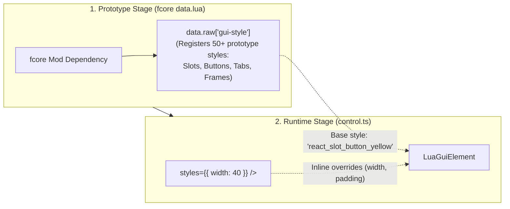

The `fcore/styles` module bridges Factorio's two-stage GUI architecture: registering 50+ high-performance prototype styles in the mod's prototype stage (`data.ts`) and applying type-safe reactive inline overrides in JSX components during runtime (`control.ts`).

---

## 🏛 How It Works: Prototype vs. Runtime Styling

All built-in GUI styles (windows, slot buttons, tabbed panes, well sections, status indicators) are automatically registered into `data.raw["gui-style"].default` when `fcore` is included as a mod dependency.



---

## 🎨 1. Component Style Variants

Built-in UI components provide type-safe props mapping directly to pre-registered Factorio prototype styles:

```tsx
import { createElement } from "fcore/react";
import { Button, SlotButton, Indicator } from "fcore/react-components";

export function StyleDemo() {
  return (
    <>
      {/* Button action styles */}
      <Button caption="Confirm" style="confirm_button" onClick={() => {}} />
      <Button caption="Delete" style="red_button" onClick={() => {}} />
      <Button caption="Back" style="back_button" onClick={() => {}} />

      {/* Slot button color variants */}
      <SlotButton color="yellow" item="iron-plate" />
      <SlotButton color="red" item="copper-ore" />
      <SlotButton color="green" item="electronic-circuit" />
      <SlotButton color="blue" item="transport-belt" />

      {/* Status indicators */}
      <Indicator color="green" tooltip="System Online" />
      <Indicator color="red" tooltip="Fault Detected" />
      <Indicator color="yellow" tooltip="Awaiting Trains" />
    </>
  );
}
```

### Style Name Types

Each GUI element type provides a dedicated union type for all valid style names:

* `ButtonStyles` — Vanilla and reactive button styles (`react_slot_button_*`, `confirm_button`, `red_button`, etc.)
* `FrameStyles` — Window frames, shallow boxes, and inner panels (`inside_shallow_frame`, `dialog_frame`, etc.)
* `LabelStyles` — Typography styles (`react_frame_title`, `caption_label`, `bold_label`, etc.)
* `ScrollPaneStyles` — Scroll areas (`react_scroll_pane`, `scroll_pane_in_shallow_frame`, etc.)
* `TableStyles` — Grid layouts (`react_table`, `react_bordered_table`, `slot_table`, etc.)
* `FlowStyles` — Flow containers (`react_horizontal_flow`, `react_vertical_flow`, `react_titlebar_flow`, etc.)
* `DropdownStyles`, `CheckboxStyles`, `SliderStyles`, `ProgressbarStyles`, `TabStyles`, `TabbedPaneStyles`, `ImageStyles`, etc.

The universal `StyleFor<E>` type maps any element tag `E` to its valid style names:

```tsx
// Full autocomplete on known styles, while seamlessly accepting custom string names:
export type StyleFor<E extends string = string> = E extends GuiElementType
  ? ElementStyleMap[E] | (string & {})
  : string;
```

---

## ⚡ 2. Utility-First Styling with `className="..."` (Tailwind-like)

`fcore` includes a build-time **TypeScript AST Style Transformer** that brings modern, declarative web styling to Factorio 2.0 without any runtime overhead.

```tsx
import { createElement } from "fcore/react";
import { VFlow, HFlow, Label, Input, Button } from "fcore/react-components";

export function NetworkCard() {
  return (
    <VFlow className="w-80 p-md gap-sm items-center justify-between">
      <HFlow className="w-full items-center justify-between">
        <Label caption="Network Status" className="font-bold text-sm text-dim" />
        <Label caption="ONLINE" className="font-bold text-sm text-green" />
      </HFlow>
      <Input text="42" className="w-full" />
      <Button caption="Refresh" className="w-full" onClick={() => {}} />
    </VFlow>
  );
}
```

### 🚀 Zero Runtime Overhead (Build-Time AST Compilation)

The `className` string is **never parsed in Lua at runtime**. During TSTL compilation, `fcore/scripts/tailwind-transformer.cjs` intercepts the JSX AST and compiles `className` directly into static `styles={{ ... }}` objects:

```tsx
// Written JSX:
<Label caption="Status" className="font-bold text-sm text-dim" />

// Transpiles at build-time directly to:
<Label caption="Status" styles={{ font: "default-small-bold", font_color: { r: 0.7, g: 0.7, b: 0.7 } }} />
```

### 🛡️ Strict Capability-Based Type Checking

`fcore` enforces strict element capabilities at compile time via `ClassNameProp<E, C>`. TypeScript will autocomplete only the valid tokens for the specific element and flag invalid classes with red squiggly lines in your IDE:

* `<Label className="gap-xs" />` ❌ Error: `gap-*` is only allowed on containers (`flow`, `table`, `frame`), not on text elements!
* `<HFlow className="font-bold" />` ❌ Error: `font-*` is only allowed on text elements (`label`, `button`, `textfield`), not on layout flows!

### 📋 Token Cheat Sheet

| Category | Utility Classes | Native Factorio LuaStyle |
| :--- | :--- | :--- |
| **Dimensions** | `w-full`, `w-<N>`, `min-w-<N>`, `max-w-<N>`, `h-full`, `h-<N>`, `min-h-<N>`, `max-h-<N>`, `size-<N>` | `width`, `height`, `horizontally_stretchable`, etc. |
| **Spacing Tokens** | `none` (0), `xs` (4px), `sm` (8px), `md` (12px), `lg` (16px), `xl` (24px), or raw number | Standard 4px spacing scale |
| **Gap** | `gap-<token>`, `gap-x-<token>`, `gap-y-<token>` | `horizontal_spacing`, `vertical_spacing` |
| **Padding** | `p-<token>`, `px-<token>`, `py-<token>`, `pt-*`, `pr-*`, `pb-*`, `pl-*` | `top_padding`, `right_padding`, `bottom_padding`, `left_padding` |
| **Margin** | `m-<token>`, `mx-<token>`, `my-<token>`, `mt-*`, `mr-*`, `mb-*`, `ml-*` | `top_margin`, `right_margin`, `bottom_margin`, `left_margin` |
| **Table Cells** | `cell-p-<token>` | `top_cell_padding`, `left_cell_padding`, etc. |
| **Alignment** | `items-start`, `items-center`, `items-end`, `justify-start`, `justify-center`, `justify-end` | `vertical_align`, `horizontal_align` |
| **Typography** | `font-bold`, `font-semibold`, `font-small`, `font-small-bold`, `font-large`, `font-mono`, `text-base` | `font: "default-..."` |
| **Text Colors** | `text-white`, `text-dim`, `text-muted`, `text-green`, `text-amber`, `text-red`, `text-cyan`, `text-yellow` | `font_color: { r, g, b }` |
| **Text Layout** | `truncate`, `single-line`, `wrap`, `multiline`, `rich-text` | `single_line`, `rich_text_setting` |
| **Squash** | `squash`, `squash-v` | `horizontally_squashable`, `vertically_squashable` |

---

## 🎨 3. Explicit Inline Overrides (`styles={{ ... }}`)

Every JSX element also accepts a `styles` prop for customizing runtime dimensions, margins, paddings, and alignments using explicit JavaScript objects. Property names and types are strictly validated at compile-time via `StylesFor<E>`:

```tsx
import { createElement } from "fcore/react";
import { VFlow, HFlow, Label, Input } from "fcore/react-components";

export function CustomLayout() {
  return (
    <VFlow
      styles={{
        width: 380,
        padding: 12,
        gap: 8,
        horizontal_align: "center",
      }}
    >
      <HFlow styles={{ vertical_align: "center", gap: 10 }}>
        <Label caption="Network ID:" styles={{ width: 100, font: "default-bold" }} />
        <Input text="42" styles={{ width: 140 }} />
      </HFlow>
    </VFlow>
  );
}
```

### Supported Runtime Properties

`fcore` provides complete compile-time type safety for **100% of Factorio 2.0 `LuaStyle` properties**, accurately inferred for each specific element:

* **Dimensions:** `width`, `height`, `minimal_width`, `maximal_width`, `minimal_height`, `maximal_height`
* **Layout & Spacing:** `padding`, `top_padding`, `bottom_padding`, `left_padding`, `right_padding`, `margin`, `gap`
* **Alignment:** `horizontal_align` (`"left"` | `"center"` | `"right"`), `vertical_align` (`"top"` | `"center"` | `"bottom"`)
* **Stretch & Squash:** `horizontally_stretchable`, `vertically_stretchable`, `horizontally_squashable`
* **Typography (Labels & Buttons):** `font`, `font_color`, `single_line`, `rich_text_setting`
* **Element-Specific:** `horizontal_spacing` on flows, `cell_padding` on tables, `selected_font_color` on buttons

---

## 💡 3. Automatic Override Preservation

In native Factorio C++, assigning `elem.style = "new_style"` immediately resets all custom dimensions (`width`, `height`, `padding`) back to the prototype's default values.

The `fcore` Reconciler handles this automatically: whenever a base `style` changes dynamically, it **re-applies all active `styles` overrides**, ensuring layouts never collapse or glitch.

---

## 🛠 4. Registering Custom Prototype Styles

If your mod creates new prototype styles in `data.ts`, use `getDefaultStyles()` to access the global style table and type-check with `satisfies`:

```ts
// data.ts
import type { ButtonStyleSpecification, FrameStyleSpecification } from "factorio:prototype";
import { getDefaultStyles } from "fcore/styles";

const styles = getDefaultStyles();
if (styles) {
  styles.my_custom_button = {
    type: "button_style",
    parent: "button",
    default_font_color: [1, 0.8, 0],
    height: 36,
  } satisfies ButtonStyleSpecification;

  styles.my_panel_frame = {
    type: "frame_style",
    parent: "inside_shallow_frame",
    padding: 16,
  } satisfies FrameStyleSpecification;
}
```

Since `StyleFor<E>` uses the open union pattern `(string & {})`, your custom style names (`style="my_custom_button"`) work immediately in JSX components without requiring any type declarations or module augmentations.

---

## 🖼 5. Built-In Icons & Sprites

`fcore` automatically registers high-resolution GUI sprite prototypes in `data.ts`, accessible across any mod that depends on `fcore`.

### Standard Sprites

* **Action Icons:** `react_questionmark`, `react_filter_all`, `react_filter_private`, `react_plus_white`, `react_trash_white`, `react_close_red`, `react_check_green`
* **Window Controls:** `react_pin_white`, `react_pin_black`, `react_settings_white`, `react_settings_black`
* **Status Indicators:** `react_indicator_green`, `react_indicator_red`, `react_indicator_yellow`, `react_indicator_blue`, `react_indicator_orange`, `react_indicator_cyan`, `react_indicator_purple`, `react_indicator_pink`, `react_indicator_white`, `react_indicator_black`

```tsx
import { createElement } from "fcore/react";
import { SpriteButton, HFlow } from "fcore/react-components";

export function WindowToolbar() {
  return (
    <HFlow styles={{ gap: 4 }}>
      <SpriteButton sprite="react_questionmark" tooltip="Help" onClick={() => {}} />
      <SpriteButton sprite="react_filter_all" tooltip="Filter All" onClick={() => {}} />
      <SpriteButton sprite="react_plus_white" tooltip="Add Item" onClick={() => {}} />
      <SpriteButton sprite="react_trash_white" tooltip="Delete" onClick={() => {}} />
    </HFlow>
  );
}
```

