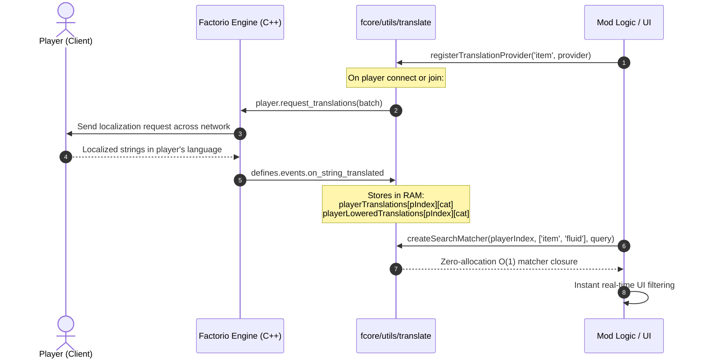

The `fcore/utils/translate` module provides a high-performance, asynchronous translation engine and real-time search matcher for Factorio 2.0. It bridges Factorio's native C++ localization engine with Lua runtime search filters.

---

## 🏛 Architecture & Multiplayer Lifecycle

In Factorio, prototype identifiers are always English strings (e.g. `iron-plate`, `assembling-machine-1`), while players experience the game in their native language (e.g. Russian, German, Chinese, French).

Factorio GUI elements natively accept `LocalisedString` tuples (e.g. `{"item-name.iron-plate"}`) for captions and tooltips at 0 Lua cost. However, **text search** (e.g. typing "железо" in an inventory picker) requires resolving translated text strings in Lua memory.

`fcore/utils/translate` manages the complete asynchronous translation lifecycle and partitions results per-player and per-category:



---

## 📦 Category Partitioning & Prototype Isolation

To prevent prototype name collisions (e.g. recipe `"iron-plate"` vs item `"iron-plate"`, or entity `"boiler"` vs item `"boiler"`), translations are strictly partitioned by native Factorio categories:

```ts
export type TranslationCategory =
  | 'item'
  | 'fluid'
  | 'recipe'
  | 'entity'
  | 'technology'
  | 'item-group'
  | 'quality';
```

- Each category has its own sub-dictionary in transient RAM: `playerTranslations[playerIndex][category][name]`.
- All transient dictionaries are stored in Lua RAM (never in `storage`), ensuring zero savegame bloat and complete session isolation.
- Departed players are automatically cleaned up on `defines.events.on_player_removed`.

---

## 🚀 1. Registering Translation Providers

Register providers once at the mod initialization stage. When any player joins or connects, all registered providers are queried automatically:

```ts
import { registerTranslationProvider, type TranslatableItem } from 'fcore/utils/translate';
import * as Cache from './cache';

// Register item and fluid translations for search
registerTranslationProvider((playerIndex) => {
  const items: TranslatableItem[] = [];
  const fluids: TranslatableItem[] = [];

  for (const item of Cache.getAllItems()) {
    items.push({ name: item.name, localisedName: item.localisedName });
  }

  for (const fluid of Cache.getAllFluids()) {
    fluids.push({ name: fluid.name, localisedName: fluid.localisedName });
  }

  return {
    item: items,
    fluid: fluids,
  };
});
```

---

## 📥 2. Flexible Input Formats

`requestTranslations` and providers accept any of three convenient data representations:

### A. Objects with `name` and `localisedName` (Recommended)
Pass objects directly from your cache or prototype data without creating intermediate dictionaries:

```ts
import { requestTranslations } from 'fcore/utils/translate';

requestTranslations(playerIndex, 'item', [
  { name: 'iron-plate', localisedName: ['item-name.iron-plate'] },
  { name: 'steel-plate', localisedName: ['item-name.steel-plate'] },
]);
```

### B. Plain String Arrays (`string[]`)
`fcore` automatically synthesizes standard Factorio localization keys (`item-name.*`, `fluid-name.*`, `entity-name.*`, etc.):

```ts
// Automatically resolves to ['item-name.iron-ore'], ['item-name.copper-ore']
requestTranslations(playerIndex, 'item', ['iron-ore', 'copper-ore']);
```

### C. Dictionaries (`Record<string, LocalisedString>`)
For custom or mod-defined localization keys:

```ts
requestTranslations(playerIndex, 'entity', {
  'custom-furnace': ['my-mod.custom-furnace-title'],
  'quantum-beacon': ['', ['entity-name.beacon'], ' (Quantum Mk.II)'],
});
```

---

## 🔍 3. Real-Time Search Matching (`createSearchMatcher`)

The `createSearchMatcher` factory creates a pre-computed matcher closure optimized for Factorio's UI loop:

```tsx
import { createElement, useState, useMemo } from 'fcore/react';
import { Input, Frame, Table } from 'fcore/react-components';
import { createSearchMatcher } from 'fcore/utils/translate';
import * as Cache from '../cache';

export function ResourcePicker({ playerIndex }: { playerIndex: PlayerIndex }) {
  const [query, setQuery] = useState('');

  // 1. Create memoized search matcher
  const matcher = useMemo(() => {
    return createSearchMatcher(playerIndex, ['item', 'fluid'], query);
  }, [playerIndex, query]);

  // 2. Query cache using matcher
  const filteredSubgroups = useMemo(() => {
    return Cache.getResourceSubgroups({ matcher });
  }, [matcher]);

  return (
    <Frame direction="vertical">
      <Input text={query} on_text_changed={setQuery} />
      {/* Render matching items */}
    </Frame>
  );
}
```

### Zero-Allocation Search Performance
- **Closure Caching:** `createSearchMatcher` resolves sub-dictionary references (`playerLoweredTranslations[playerIndex]?.[category]`) **once** before entering the search loop.
- **No String Allocations:** Searches match directly against pre-lowercased identifiers and pre-lowercased translations without string concatenation or temporary tables.
- **Polymorphic Calling:**
  - `matcher(res.name, res.type)`: Performs an instant $O(1)$ lookup in the specific category dictionary.
  - `matcher(res.name)`: Automatically checks across all allowed categories provided to `createSearchMatcher`.

---

## 🎯 4. Direct Translation Lookup (`getTranslation`)

Retrieve the original-cased translated string for a specific entity if already received from the client:

```ts
import { getTranslation } from 'fcore/utils/translate';

const localizedTitle = getTranslation(playerIndex, 'item', 'iron-plate');
// Returns: "Железная пластина" (if Russian client), or undefined if still pending
```

---

## ⚡ Best Practices

1. **GUI Captions vs Text Search:**
   - **For Captions & Tooltips:** Always pass `LocalisedString` (e.g. `proto.localised_name`) directly to GUI components (`<Label caption={item.localisedName} />`). Factorio's C++ engine translates it automatically at 0 Lua cost.
   - **For Search Inputs:** Use `fcore/utils/translate` to index strings so users can search in their native language.
2. **Translate Only What Is Searched:**
   Only register categories that users can actively search for via text inputs. If machines, beacons, or groups are selected from fixed grids without search inputs, do not request translations for them.
3. **Multiplayer Isolation:**
   Never assume player locales are identical. Always pass `playerIndex` to search matchers and translation lookups.
