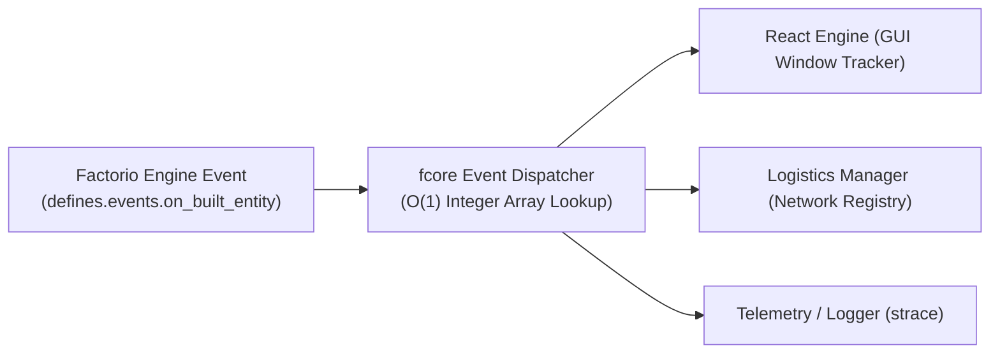

The `fcore/utils/event` module provides a centralized event bus that eliminates the Factorio C++ engine's single-handler limitation, allowing multiple independent systems to subscribe to the same events safely.

---

## 🏛 How It Works: The Event Multiplexer

In vanilla Factorio, calling `script.on_event` a second time overwrites any previously registered callback. `fcore` resolves this by acting as a central dispatcher:



---

## 🚀 1. Game & Lifecycle Events (`event.bind`)

Subscribe to game events, lifecycle hooks, and periodic tick intervals with strict TypeScript typing:

```ts
/** @noSelfInFile */
import * as event from "fcore/utils/event";

// 1. Standard Factorio game event (payload is strictly typed)
event.bind(defines.events.on_gui_click, (e) => {
  log(`Clicked element: ${e.element.name}, player: ${e.player_index}`);
});

// 2. Mod lifecycle hooks
event.bind("on_init", () => {
  storage.my_mod_data = { networks: [] };
});

event.bind("on_configuration_changed", (data) => {
  if (data.mod_changes["my-mod"]) {
    log("Mod version updated! Running migrations...");
  }
});

// 3. Periodic tick intervals (e.g. every 60 ticks / 1 second)
event.bind(event.nth_tick(60), (tickData) => {
  // Executes once per second
});
```

---

## 🏗 2. Unified Entity Lifecycle (`onEntityCreated` / `onEntityDestroyed`)

Factorio 2.0 has 5 separate events for creating entities (player, robot, blueprint, Space Age orbital platform, script). `fcore` collapses them into one clean, filtered callback:

```ts
import * as event from "fcore/utils/event";

// Automatically handles player build, robot build, blueprint revive, and space platforms
event.onEntityCreated("my-custom-combinator", ({ entity, playerIndex, tags, revived }) => {
  log(`Created ${entity.name} #${entity.unit_number}, fromBlueprint=${Boolean(tags?.from_blueprint)}`);
});

// Automatically handles player mining, robot deconstruction, and entity death
event.onEntityDestroyed("my-custom-combinator", ({ entity, unitNumber }) => {
  log(`Destroyed entity #${unitNumber}`);
});
```

---

## 📡 3. Custom Mod Events (`event.raise`)

Enable decoupled communication between different subsystems of your mod:

```ts
import * as event from "fcore/utils/event";

// 1. Subscribe to custom string event
event.bind("on_network_rebalanced", (networkId: number, balance: number) => {
  log(`Network ${networkId} rebalanced: ${balance}`);
});

// 2. Raise event from another module
event.raise("on_network_rebalanced", 42, 1000);
```

