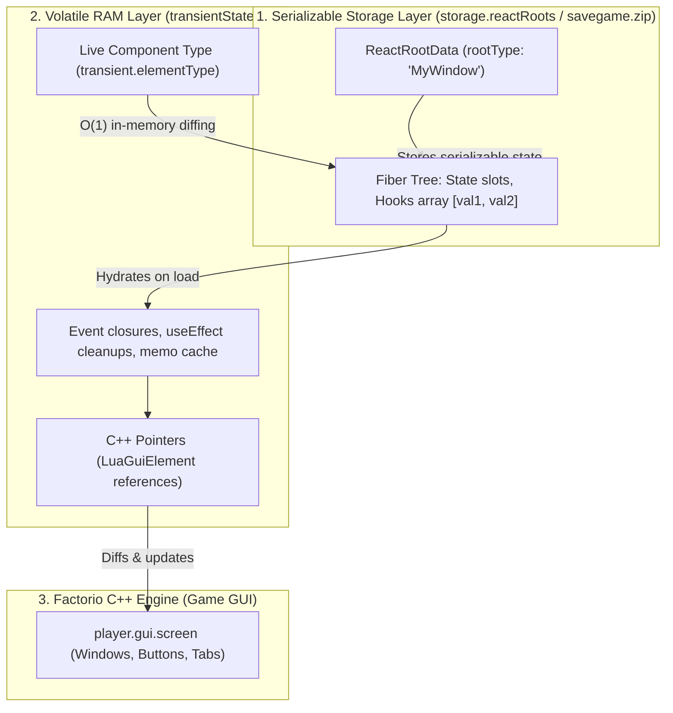

`fcore/react` brings modern declarative React architecture to Factorio 2.0. Write clean JSX components with stateful hooks (`useState`, `useEffect`, `useCallback`, `useInterval`, `useMemo`), while the reconciler manages C++ `LuaGuiElement` lifecycles, intelligent sub-tree bailouts, and multiplayer savegame persistence.

---

## 🏛 How It Works: The Dual-Memory Architecture

Factorio requires multiplayer simulation state to be serializable, while native C++ pointers (`LuaGuiElement`) and closures exist only in volatile RAM. `fcore` automatically splits UI state into two synchronized layers:



---

## 🚀 1. Creating a Reactive Window Component

Build windows using standard functional components, hooks, and built-in UI primitives:

```tsx
import { createElement, useState, useMemo } from "fcore/react";
import { WindowFrame, Titlebar, VFlow, HFlow, Button, Label, Input } from "fcore/react-components";
import type { PlayerIndex } from "factorio:runtime";

export interface CounterWindowProps {
  playerIndex: PlayerIndex;
  initialCount?: number;
  onClose: (this: void) => void;
}

export function CounterWindow({ playerIndex, initialCount = 0, onClose }: CounterWindowProps) {
  const [count, setCount] = useState(initialCount);

  return (
    <WindowFrame styles={{ width: 320 }}>
      <Titlebar title="My Reactive Window" onClose={onClose} />
      <VFlow styles={{ padding: 12, gap: 10 }}>
        <HFlow styles={{ vertical_align: "center", gap: 8 }}>
          <Label caption="Current value:" />
          <Label caption={tostring(count)} styles={{ font: "default-bold" }} />
        </HFlow>

        <HFlow styles={{ gap: 8 }}>
          <Button caption="-1" onClick={() => setCount((prev) => prev - 1)} />
          <Button caption="+1" style="confirm_button" onClick={() => setCount((prev) => prev + 1)} />
          <Button caption="Reset" style="red_button" onClick={() => setCount(0)} />
        </HFlow>
      </VFlow>
    </WindowFrame>
  );
}
```

---

## 🚪 2. Mounting, Unmounting & Component Registration

### Root Windows vs. Child Components

A critical architectural distinction in `fcore`:

* **Root Window Components (Registered):**
  Factorio cannot serialize Lua closures or functions into savegame storage. Top-level window components passed to `createRoot` **must be registered** with `registerComponent("WindowName", WindowComponent)`. On game reload (`on_load`), React reads the string `"WindowName"` from `storage.reactRoots` and re-attaches the component function.
* **Child Components (Unregistered):**
  Child JSX components (`<TabbedPane>`, `<Tab>`, `<SlotButton>`, custom sub-components) are resolved dynamically in RAM during the parent's render pass. They **do not require registration**.

```tsx
/** @noSelfInFile */
import { bootstrapReact, registerComponent, createRoot, destroyRoot } from "fcore/react";
import { CounterWindow } from "./CounterWindow";
import type { PlayerIndex } from "factorio:runtime";

// 1. Initialize React engine in control.ts
bootstrapReact();

// 2. Register ONLY the root window component
registerComponent("CounterWindow", CounterWindow);

// 3. Open window for player
export function openCounterWindow(playerIndex: PlayerIndex) {
  const player = game.get_player(playerIndex);
  if (!player) return;

  createRoot(
    player.gui.screen,
    <CounterWindow
      playerIndex={playerIndex}
      onClose={() => closeCounterWindow(playerIndex)}
    />
  );
}
```

---

## ⚡ 3. In-Memory Component Identity & Auto-Bailout

The `fcore` reconciler tracks live component function references directly in RAM (`transient.elementType`):

1. **Deterministic Component Swapping:**
   In Factorio 2.0 Lua VM, `tostring(any_function)` returns `"function"` to prevent multiplayer desyncs. The reconciler uses in-memory reference equality (`oldCompType === compType`), ensuring that dynamically swapping tabs (e.g. `<CombinatorTab>` to `<SettingsTab>`) correctly unmounts and remounts components without requiring manual keys.
2. **Zero-Cost Sub-Tree Bailouts:**
   When `setState` triggers an update, the reconciler checks if a component's props and state have changed (`arePropsEqual`). If props are identical and the branch is clean, execution skips the entire sub-tree at 0 ms CPU cost.

```tsx
// Memoizing props ensures child components achieve 100% bailout efficiency:
const comb = useMemo(() => (entity.valid ? new Combinator(entity) : undefined), [entity]);

return <CombinatorTab playerIndex={playerIndex} combinator={comb} />;
```

---

## ⚡ 4. Entity Synchronization (`useEntityLifecycle`)

When building windows attached to game entities (e.g. combinators, assemblers, chests), use `useEntityLifecycle` to automatically close the window when the entity dies or reconnect when revived:

```tsx
import { createElement } from "fcore/react";
import { useEntityLifecycle } from "fcore/react";
import type { LuaEntity } from "factorio:runtime";

export function EntityWindow({ entity, onClose }: { entity: LuaEntity; onClose: (this: void) => void }) {
  // Automatically handles entity mining, destruction, and revival
  useEntityLifecycle(entity, {
    onDestroyed: () => {
      onClose(); // Close window if entity is destroyed by biters or mined by a player
    },
    onRevived: (newEntity) => {
      // Reconnected to newly revived entity
    },
  });

  return (
    <WindowFrame>
      <Titlebar title={entity.name} onClose={onClose} />
      {/* ... */}
    </WindowFrame>
  );
}
```

---

## ⏱ 5. Periodic GUI Updates (`useInterval`)

To update GUI telemetry at fixed intervals without flooding `on_tick`:

```tsx
import { createElement, useState, useInterval } from "fcore/react";
import { Label } from "fcore/react-components";

export function LiveStats() {
  const [tick, setTick] = useState(() => game.tick);

  // Updates state every 60 ticks (1 second) via bucketed scheduler
  useInterval(() => {
    setTick(game.tick);
  }, 60);

  return <Label caption={`Game Tick: ${tick}`} />;
}
```

---

## 💡 Best Practices

1. **Keys in dynamic lists:** Always specify a unique `key` when rendering lists (`items.map(item => <SlotButton key={item.id} />)`) so the reconciler moves elements without recreation.
2. **Register only roots:** Only top-level window components passed to `createRoot` need `registerComponent`. Child components do not.
3. **Never use JS global constructors:** Always use `tostring(x)`, `tonumber(x)`, and boolean checks (`val !== undefined && val !== false`) instead of `String(x)`, `Number(x)`, `Boolean(x)`.
4. **Bailout optimization:** If `setState` receives the exact same value (`prev === next`), the reconciler immediately cancels rendering at 0 ms cost.

