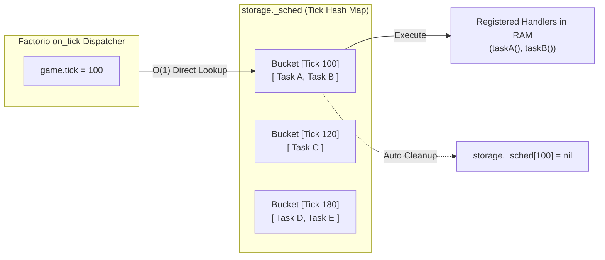

The `fcore/utils/scheduler` module provides a tick-bucketed scheduling engine designed to eliminate CPU frame-time spikes (UPS drops) caused by naive `on_tick` per-frame polling.

---

## 🏛 How It Works: Tick Bucketing

Instead of iterating through thousands of entities every frame, the scheduler groups tasks into discrete tick buckets in `storage._sched`. On each frame, only the bucket for `game.tick` is executed:



---

## 🚀 1. Registering Task Handlers

Handlers are registered in module scope by string ID (so they survive save/load without storing functions in `storage`):

```ts
/** @noSelfInFile */
import * as scheduler from "fcore/utils/scheduler";
import type { PlayerIndex } from "factorio:runtime";

interface ScanPayload {
  networkId: number;
  playerIndex: PlayerIndex;
}

scheduler.register_handler<ScanPayload>("recheck_network", (data, tick) => {
  log(`Executing network scan for #${data.networkId} on tick ${tick}`);
});
```

---

## ⏱ 2. One-Shot Delayed Tasks (`after` / `at`)

Schedule tasks to run after a delay or at a specific future tick:

```ts
import * as scheduler from "fcore/utils/scheduler";

// Run in 120 ticks (2 seconds)
const taskId = scheduler.after(120, "recheck_network", {
  networkId: 1,
  playerIndex: player.index,
});

// Run at specific game tick
scheduler.at(game.tick + 300, "recheck_network", {
  networkId: 2,
  playerIndex: player.index,
});
```

---

## 🔄 3. Recurring Interval Tasks (`every` / `stop`)

Schedule periodic background workers and cancel them when no longer needed:

```ts
import * as scheduler from "fcore/utils/scheduler";

// Runs every 60 ticks (1 second)
const recurringId = scheduler.every(60, "recheck_network", {
  networkId: 1,
  playerIndex: player.index,
});

// Cancel task
scheduler.stop(recurringId);
```

