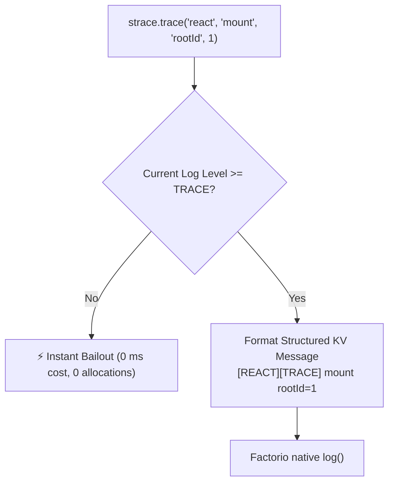

The `strace` module provides structured, multi-level diagnostic logging with **zero runtime overhead** when logging levels are disabled.

---

## 🎯 The Problem with Raw `log()`

Standard `log()` in Factorio has three major drawbacks:
1. **Unconditional String Allocation:** Constructing strings (`log("Player " .. id .. " clicked " .. name)`) generates Lua garbage on every call even if diagnostic logging is not needed.
2. **No Log Levels:** Cannot toggle verbose debug traces without commenting out code or rebuilding the mod.
3. **Unstructured Output:** Hard to filter logs by subsystem (e.g. `react`, `scheduler`, `network`).

---

## 🏗 `strace` Architecture & Log Levels



### Hierarchy of Log Levels:
1. **`TRACE`** (Level 1) — High-frequency internal tracing (virtual DOM diffing, scheduler tick dispatch).
2. **`DEBUG`** (Level 2) — Diagnostics (window coordinates, network packet details).
3. **`INFO`** (Level 3) — Key user-level lifecycle events (window mounted, entity built).
4. **`WARN`** (Level 4) — Non-fatal issues (missing optional prototype, fallback triggered).
5. **`ERROR`** (Level 5) — Exceptions and invariant violations.

---

## 📖 API & Patterns

### 1. Key-Value Structured Tracing

Instead of string concatenation, pass arguments as key-value pairs:

```ts
/** @noSelfInFile */
import { strace } from "fcore/utils/strace";

// Output: [GUI][INFO] Window opened playerIndex=1 windowKey="main_panel"
strace.info("gui", "Window opened", "playerIndex", player.index, "windowKey", "main_panel");

// Output: [SCHED][DEBUG] Tick processed tick=1042 taskCount=3
strace.debug("sched", "Tick processed", "tick", game.tick, "taskCount", tasks.length);
```

---

### 2. Global Runtime Log Level Configuration

The `fcore` mod automatically registers a global runtime setting (`fcore-log-level`, defaulting to `INFO`).

All mods using `fcore/utils/strace` automatically respect this global setting without needing to define their own setting prototypes.

Players and mod developers can adjust the log level in the Factorio Mod Settings menu (`Map` / `Global`) **without restarting the game or reloading the save**, instantly controlling diagnostic output across all `fcore`-powered mods.


