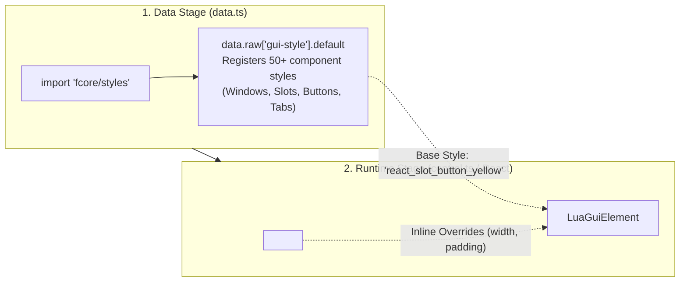

The `fcore/styles` system bridges Factorio's two-phase GUI engine: registering high-performance prototype styles in `data.ts` and applying reactive inline overrides in JSX components during `control.ts`.

---

## 🏛 How It Works

Factorio GUI styling operates across two distinct engine stages:



---

## 🚀 Quickstart: Loading Styles

Add one import to your mod's `data.ts`. This automatically injects all necessary styles for `WindowFrame`, `Titlebar`, `SlotButton`, `WellSection`, `TabbedPane`, and standard widgets:

```ts
/** @noSelfInFile */
// src/data.ts
import "fcore/styles";
```

---

## 🎨 Component Style Variants

Built-in components provide type-safe style props corresponding to Factorio prototype styles:

```tsx
import { createElement } from "fcore/react";
import { Button, SlotButton, Indicator } from "fcore/react-components";

export function StyleDemo() {
  return (
    <>
      {/* Button action variants */}
      <Button caption="Confirm" variant="confirm" onClick={() => {}} />
      <Button caption="Delete" variant="danger" onClick={() => {}} />
      <Button caption="Back" variant="back" onClick={() => {}} />

      {/* Slot button color variants */}
      <SlotButton color="yellow" item="iron-plate" />
      <SlotButton color="red" item="copper-ore" />
      <SlotButton color="green" item="electronic-circuit" />

      {/* Status indicators */}
      <Indicator color="green" tooltip="Online" />
      <Indicator color="red" tooltip="Fault detected" />
    </>
  );
}
```

---

## ⚡ Inline Style Overrides (`styles={{ ... }}`)

Every component accepts a `styles` prop for customizing layout dimensions, alignments, and padding. The reconciler automatically diffs properties and updates only changed values:

```tsx
import { createElement } from "fcore/react";
import { VFlow, HFlow, Label, Input } from "fcore/react-components";

export function CustomLayout() {
  return (
    <VFlow
      styles={{
        width: 380,
        padding: [8, 12],
        gap: 8,
        horizontal_align: "center",
      }}
    >
      <HFlow styles={{ vertical_align: "center", gap: 10 }}>
        <Label caption="Network ID:" styles={{ width: 100, font: "default-bold" }} />
        <Input text="42" styles={{ width: 140 }} />
      </HFlow>
    </VFlow>
  );
}
```

---

## 💡 Key Takeaway: Automatic Override Preservation

In the native Factorio C++ engine, whenever `elem.style = "new_style"` is assigned, all custom dimensions (`width`, `height`, `padding`) are reset to default prototype values.

The `fcore` Reconciler handles this under the hood: whenever a base style changes, it **automatically re-applies all inline overrides**, ensuring your window layout never breaks.

